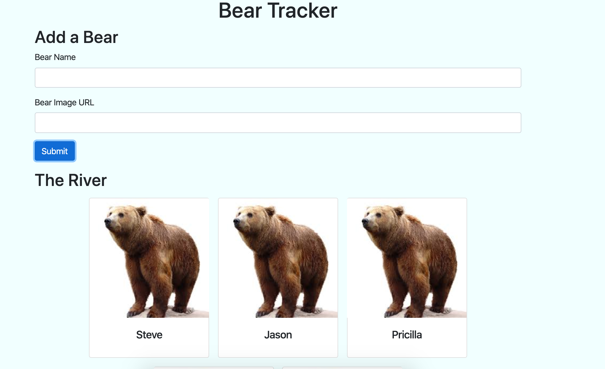
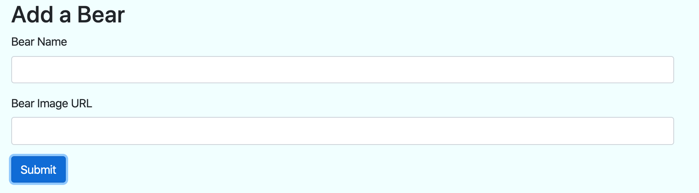
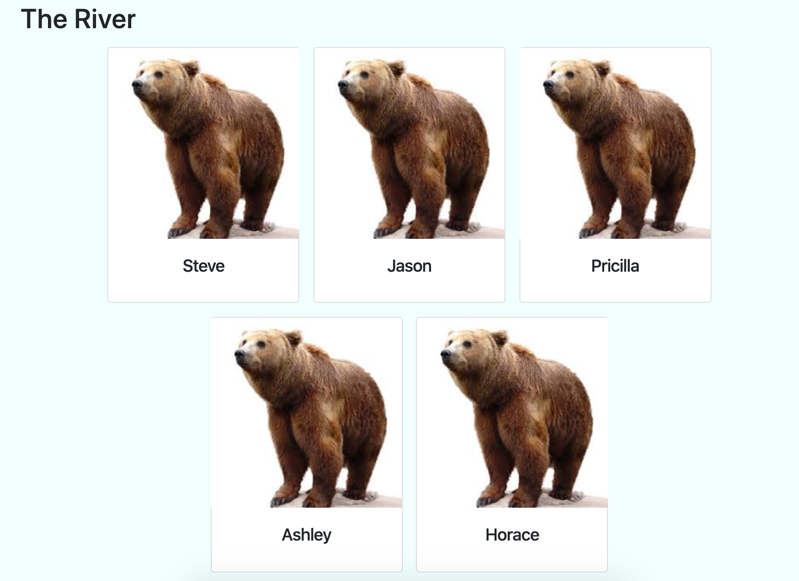

# Bear Watcher

## Description
The purpose of this project was to practice modular coding by separating Javascript out into different files.

We created a simple form from Bootstrap that allowed a user to input a Bear Name and image URL. When the submit button is clicked, those values are saved into an object and pushed to an array of bears. That click event then triggers a domString builder function that prints the bears array to the DOM, creating individual cards for each bear object.

We also utilized jQuery for the first time when creating our click events and accessing specific element Ids.

## Screenshots
Full project view

Submit Bear Form

The River - collection of bears

## How to Run
1. Clone this repo
1. Make sure you have http-server installed via npm. If not get it [here](https://www.npmjs.com/package/http-server)
1. On your command line, run `hs -p 9999`
1. In your browser, go to `http://localhost:9999`